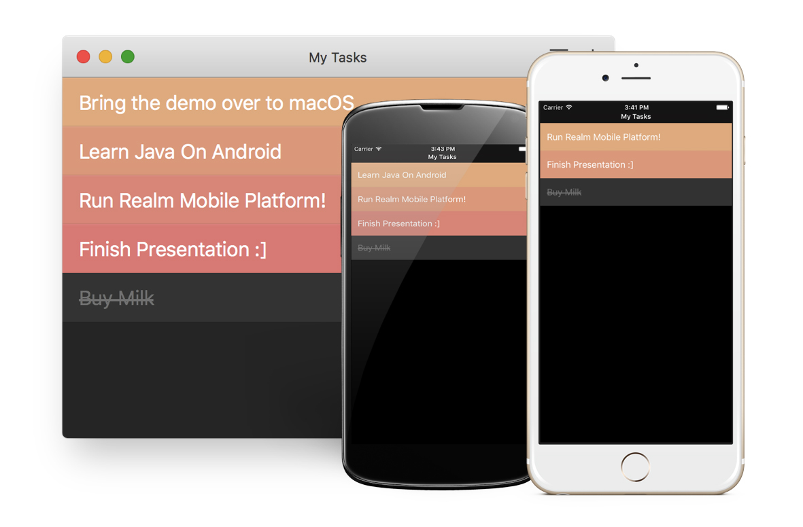

**NOTE: Below instructions are only accurate for Realm Object Server 1.8. The projects are currently being upgraded to version 2.0**

# Realm Tasks

> A basic task management app, designed as a *homage* to [Realmac Software's Clear](http://realmacsoftware.com/clear),
with their knowledge and permission.

**Warning:** This project is very much a work in progress, being used as a testbed for new Realm technologies.
It is in no way a fully feature-complete product, nor is it ever meant to be an actual competitor for the Clear app.

# Requirements

### Cocoa

* Xcode 8.
* CocoaPods 1.0.1.

### Android

* Android Studio 2.2 with Android API 25
* An emulator, Genymotion or a real device attached and running.

## 1. Get the Realm Platform Package and start the Object Server

1. Download and extract the Realm Mobile Platform package from <https://realm.io/docs/realm-mobile-platform/get-started/>.
2. Double-click the `start-object-server.command` script in the package obtained above.

## 2. Build and Run RealmTasks

### Cocoa

1. Run `pod install` from the `RealmTasks Apple` directory in this repo.
2. Open `RealmTasks Apple/RealmTasks.xcworkspace` with Xcode 8.
3. Select either the "RealmTasks macOS" or "RealmTasks iOS" depending on which platform you'd like to try the app on.
4. Click the "Build and Run" icon in the upper left of Xcode (play icon).
5. When the app launches, tap/click "Register" if this is the first time you're trying the app, or "Log In" if you've
   already created an account.
6. Optional: If you'd like to run the app on a physical iPhone, you'll need to have code signing set up with Xcode, and
   the iPhone should be connected on the same local network as your Mac running the object server.

### Android

1. Go to the `RealmTasks Android` folder.
2. Run `./gradlew installDebug`
3. The RealmTask app should now be installed on all attached Android devices and emulators. You need to launch the app manually.

### Using RealmTasks

At this point, you can login, start creating items, managing lists, and you'll see your actions reflected in real time in other
running instances of the app wether it is the Android, iOS or macOS app.

We recommend that you run at least two instances of the app together to really show off sync in action.

## 3. Access Realm Files with the Realm Browser

1. Launch the "Realm Browser" app included in the package obtained above and click "Open Sync URL...".
2. Paste the following into the Realm Browser's Sync Server URL field: `realm://127.0.0.1:9080/~/realmtasks`.
3. Enter the same username and password as you used when running RealmTasks and click "Open".

# Compatibility

RealmTasks is designed to be cross platform, so versions for all platforms/languages should be able to sync with each other. There may be slight discrepancies in terms of functionality which will be listed here.

- Authentication against Azure Active Directory is only supported in the Xamarin version.

# Third Party Dependencies

### Cocoa

The following modules will be installed as part of the CocoaPods installation:

* [Realm Swift](https://realm.io) - The Swift version of the Realm Mobile Database.
* [Realm LoginKit](https://github.com/realm-demos/realm-loginkit) - A Realm control for logging in to Realm servers.
* [Cartography](https://github.com/robb/Cartography) - A library for making it easier to define auto layout constraints in code.
* [SwiftLint](https://github.com/realm/SwiftLint) - A tool for validating the quality of Swift code.

# Contributing

See [CONTRIBUTING.md](CONTRIBUTING.md) for more details!

This project adheres to the [Contributor Covenant Code of Conduct](https://realm.io/conduct/). By participating, you are expected to uphold this code. Please report unacceptable behavior to [info@realm.io](mailto:info@realm.io).

# License

The source code for RealmTasks is licensed under the [Apache License 2.0](LICENSE).

